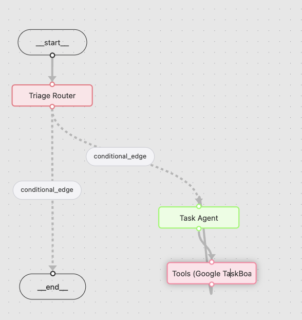
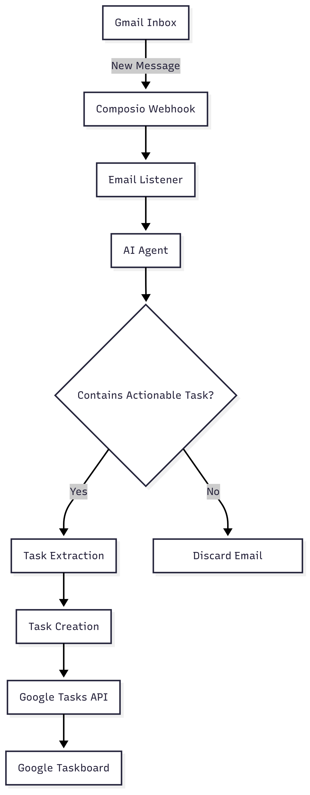

# Quick Task Email Listener

A Python-based email listener and task extractor using Composio Dev and Gmail integration. This service listens for incoming emails, uses an AI agent to identify actionable tasks, and forwards extracted tasks to Google Tasks.

---

## Table of Contents
- [Quick Task Email Listener](#quick-task-email-listener)
  - [Table of Contents](#table-of-contents)
  - [Features](#features)
  - [Prerequisites](#prerequisites)
  - [Setup \& Installation](#setup--installation)
    - [1. Composio Dev Setup](#1-composio-dev-setup)
    - [2. Adding Composio Integrations Using the CLI](#2-adding-composio-integrations-using-the-cli)
    - [3. Project Setup](#3-project-setup)
  - [Configuration](#configuration)
  - [Usage](#usage)
  - [Project Structure](#project-structure)
  - [Module Descriptions](#module-descriptions)
    - [agents/](#agents)
    - [graph/](#graph)
    - [listeners/](#listeners)
  - [Diagrams](#diagrams)
  - [Contributing](#contributing)
  - [License](#license)

---

## Features
- **Real-time Email Listening**: Triggers on new messages in the Primary or Updates tab of Gmail.
- **AI-driven Task Detection**: Classifies incoming emails to determine if they contain actionable tasks.
- **Task Extraction & Forwarding**: Extracts identified tasks and adds them to your Google Taskboard.

---

## Prerequisites
- Python 3.11 or higher
- A Composio Dev account with Gmail integration enabled

---

## Setup & Installation

### 1. Composio Dev Setup
1. Sign up or log in to your Composio Dev account.
2. Navigate to **Integrations** and enable **Gmail**.
3. Grant access to your Gmail account to allow triggers on new emails.

### 2. Adding Composio Integrations Using the CLI
You can also add and manage integrations via the Composio CLI, which is useful for automation or environments without a UI.

1. **Install the Composio CLI**  
   For Python:  
   ```bash
   pip install composio_core
   ```  
   For JavaScript:  
   ```bash
   npm install composio-core
   ```

2. **Authenticate with Composio**  
   ```bash
   composio login
   ```  
   Follow the prompt to authenticate and store your session locally.

3. **Obtain Your API Key**  
   ```bash
   composio whoami
   ```  
   Set the COMPOSIO_API_KEY:  
   ```bash
   export COMPOSIO_API_KEY=YOUR_API_KEY
   ```

4. **Add an Integration**  
   ```bash
   composio add gmail -e "EntityName"
   ```  
   Replace `gmail` with the integration name and `"EntityName"` with your desired profile name. The CLI guides you through any OAuth or API key steps.

   You will need two integrations for this project:
   1. Googletasks
   2. Gmail

   Make sure the above two apps are integrated
   
5. **(Optional) Configure Integration Settings**  
   - For OAuth-based apps, choose between Composio’s default OAuth app or your own credentials.  
   - For API key–based apps, have the end user provide their own keys during connection.

**Key Points**  
- CLI setup is one-time per app/environment.  
- Keep your API key and integration IDs confidential.  
- Refer to the [Composio Integrations Docs](https://docs.composio.dev/auth/set-up-integrations) for app-specific details.

### 3. Project Setup
```bash
# Clone the repository
git clone https://github.com/shreyasskasetty/quick-task.git
cd email-listener-agent

# Copy the environment example and install dependencies
cp env.example .env
pip install -r requirements.txt
```

---

## Configuration
1. Rename `env.example` to `.env` and populate with your credentials:
   - **COMPOSIO_API_KEY**: Your Composio Dev API key
   - **OPENAI_API_KEY**: Your OpenAI API key
2. Edit `config.py` if you need to customize listener behavior or Taskboard settings.
---

## Usage
```bash
# Start the email listener service
python main.py
```
- The service will authenticate with Composio, establish a webhook for Gmail, and begin listening.
- On each incoming email in the configured Gmail tabs, it invokes the AI agent to classify and extract tasks.
- Extracted tasks are sent to your Google Taskboard via the Google Tasks API.

---

## Project Structure
```
.
├── README.md
├── agents
│   ├── __init__.py
│   ├── email_agent.py
│   ├── email_task_agent.py
│   ├── extract_task.py
│   └── task_agent.py
├── config.py
├── env.example
├── graph
│   ├── nodes.py
│   └── state.py
├── listeners
│   ├── __init__.py
│   ├── email_listener.py
│   └── utils.py
├── main.py
├── prompts.py
└── requirements.txt
```

---

## Module Descriptions
- **main.py**: Entry point. Initializes Composio, sets up Gmail webhooks, and starts the listener.
- **config.py**: Configuration constants and environment variable loading.
- **prompts.py**: Contains AI prompt templates for classification and extraction tasks.

### agents/
- **email_agent.py**: Orchestrates classification of raw email content.
- **email_task_agent.py**: Coordinates end-to-end flow: classification ➔ extraction ➔ task creation.
- **extract_task.py**: Uses an LLM to parse actionable tasks from classified emails.
- **task_agent.py**: Interfaces with Google Tasks API to create and manage tasks.

### graph/
- **nodes.py**: LangGraph nodes defining agentic workflow steps.
- **state.py**: Graph State definitions for the Langgraph nodes

### listeners/
- **email_listener.py**: Implements the Composio webhook handler for incoming Gmail events.
- **utils.py**: Helper functions for request validation, logging, and error handling.

---


## Diagrams
Below are visual representations of the project’s key workflows:

**1. Agent Graph**
Illustrates the internal AI agent workflow, showing how tasks move from classification to extraction and creation.



**2. Flow Diagram**
Shows the end-to-end process from incoming Gmail messages through Composio, the listener, AI classification, and final task creation in Google Tasks.



## Contributing
1. Fork the repository.
2. Create a feature branch: `git checkout -b feature/YourFeatureName`.
3. Commit your changes with clear messages.
4. Push to your fork and open a Pull Request.

---

## License
This project is licensed under the MIT License. See the [LICENSE](LICENSE) file for details.

