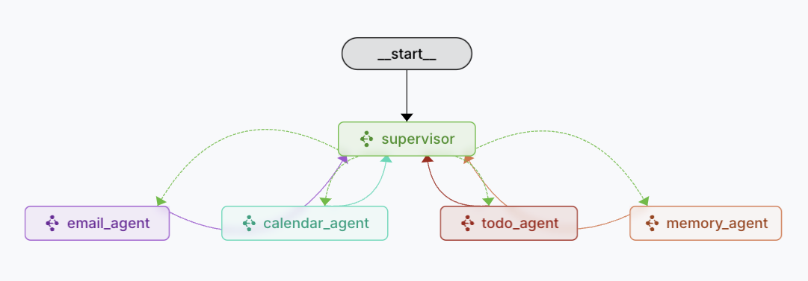

# QuickTask AI Chat Agent

A Next.js + TypeScript chat assistant that helps busy professionals stay on top of their day.  
Built around a **Supervisor Agent** that orchestrates specialized agents for Calendar, Email, Todo, and Memory management—powered by Composio integrations and LangGraph workflows.

---

## 🚀 Features

- **Supervisor Agent**  
  Routes user requests to subordinate agents and maintains overall context  
- **Calendar Agent**  
  Schedules, updates, and queries events via Google Calendar integration  
- **Email Agent**  
  Reads, composes, and sends emails using Gmail integration  
- **Todo Agent**  
  Creates, lists, and completes tasks in Google Tasks  
- **Memory Agent**  
  Persists user preferences, context snippets, and past decisions  
- **Composio‑Powered**  
  All integrations (Gmail, Calendar, Tasks) are managed through Composio’s CLI or Dashboard  

---

## 📦 Tech Stack

- **Language**: TypeScript  
- **Frontend**: Next.js (App Router) + Tailwind CSS  
- **Agent Framework**: LangGraph, Langgraph Studio
- **Integrations**: Composio Core  
- **Monorepo**: pnpm + Turborepo  
---

## 🛠️ Prerequisites

1. **Node.js** (v18+) & **pnpm**  
2. **Composio** account & CLI  
3. Google OAuth credentials (for Calendar, Gmail, Tasks)  
---

## 🔧 Setup & Installation

1. **Clone & install**  
   ```bash
   git clone https://github.com/shreyasskasetty/quick-task.git
   cd quick-task-chat-agent
   pnpm install
   ```

2. **Configure Composio**  
   - Install CLI:  
     ```bash
     # npm
     npm install -g composio-core
     # or pip
     pip install composio_core
     ```
   - Authenticate:  
     ```bash
     composio login
     ```
   - Add integrations (or via Dashboard):  
     ```bash
     composio add google-calendar    # for Calendar Agent
     composio add gmail              # for Email Agent
     composio add google-tasks       # for Todo Agent
     ```
   - Copy each `integration_id` into your `.env.local` (see below).

3. **Environment variables**  
   Create a `.env.local` at the repo root with:
   ```ini
   # Composio API
   COMPOSIO_API_KEY=your_api_key
   OPENAI_API_KEY=your_api_key
   ```
---

## 🚀 Running Locally

### 1. Agents (LangGraph)

```bash
cd apps/agents
pnpm dev
```
- Exposes your Supervisor Agent on the Composio dev environment  
- Uses `langgraph.json` to wire up agent workflows  

### 2. Web UI

```bash
cd apps/web
pnpm dev
```
- Front-end chat interface at `http://localhost:3000`  
- Connects to the Supervisor Agent via streaming API (`/api/stream`)  

---

## 📂 Project Structure

```
.
├── README.md
├── langgraph.json           # configuration file for langgraph server
├── apps
│   ├── agents               # Supervisor & agent codebase
│   │   ├── src
│   │   │   ├── agent        # Supervisor core: config, graph, state, prompts
│   │   │   ├── email_agent  # Gmail nodes & types
│   │   │   ├── meeting_agent# Calendar nodes & types
│   │   │   ├── prompts-v1.ts
│   │   │   └── utils        # shared message‑formatting helpers
│   │   └── tsconfig.json
│   └── web                  # Next.js front‑end
│       ├── src
│       │   ├── app          # layouts & pages
│       │   ├── components   # UI atoms, thread view, icons
│       │   ├── lib          # API wrappers & stream helpers
│       │   └── providers    # React context for streaming & threads
│       └── tailwind.config.js
├── package.json
├── pnpm-workspace.yaml
└── turbo.json
```

---

## 🔍 Supervisor Pattern

1. **User input** → hits the **Supervisor Agent**  
2. Supervisor inspects intent & context  
3. Routes request to one of:
   - **Calendar Agent** (scheduling, conflicts)  
   - **Email Agent** (read/send)  
   - **Todo Agent** (task CRUD)  
   - **Memory Agent** (read/write context)  
4. Gathers results, updates memory if needed, returns a unified response  

### Agent Graph Diagram


---

## 🤝 Contributing

1. Fork the repo  
2. Create a feature branch (`git checkout -b feature/xyz`)  
3. Commit & push  
4. Open a PR against `main`  

Please follow linting, formatting, and testing rules in each package.

---

## 📄 License

MIT © Shreyas Shivakumar Kasetty, Texas A&M University