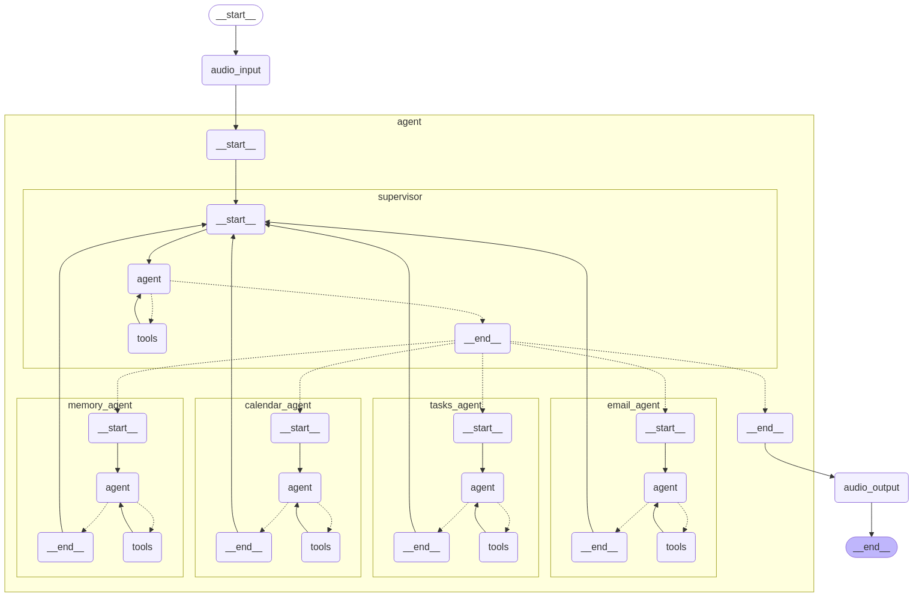

# Quick Task Voice Agent Backend

A Python‑based backend for a voice‑driven productivity assistant.  
Built on a **Supervisor Agent** pattern that delegates to specialized agents (Calendar, Email, Todo, Memory) via Composio integrations and LangGraph workflows.

---

## 🚀 Features

- **Supervisor Agent**  
  Orchestrates intent detection and routes voice commands to sub‑agents.
- **Calendar Agent**  
  Schedules, updates, and queries Google Calendar events.
- **Email Agent**  
  Reads, composes, and sends emails via Gmail.
- **Todo Agent**  
  Creates, lists, and completes tasks in Google Tasks.
- **Memory Agent**  
  Stores and retrieves user preferences and context snippets.
- **Voice Interface Ready**  
  Accepts spoken commands (via front‑end), transcribes them, and streams responses.
- **Composio‑Powered**  
  All third‑party integrations managed through Composio’s CLI or Dashboard.

---

## 📦 Tech Stack

- **Language:** Python 3.11 
- **Dependency Management:** Poetry  
- **Web Framework:** FastAPI  
- **Agent Framework:** LangGraph, Langgraph Server, Langsmith (for tracing)
- **Integrations:** Composio Core CLI  
- **Audio I/O:** Handled by front‑end layer

---

## 🛠️ Prerequisites

1. **Python** (3.11 or later)  
2. **Poetry** (for dependency & script management)  
3. **Composio** account & CLI  
4. Google OAuth credentials for Calendar, Gmail, and Tasks  
5. Copy `env.example` → `.env` and populate environment variables

---

## 🔧 Setup & Installation

1. **Clone the repository**  
   ```bash
   git clone https://github.com/your-org/quick-task.git
   cd quick-task/voice-agent-backend
   ```

2. **Install dependencies**  
   ```bash
   poetry install
   ```

3. **Configure Composio**  
   ```bash
   # Install Composio CLI if not already
   pip install composio_core

   # Authenticate with your Composio account
   composio login

   # Add integrations for each agent
   composio add google-calendar   # for Calendar Agent
   composio add gmail             # for Email Agent
   composio add google-tasks      # for Todo Agent
   ```

4. **Environment variables**  
   Copy `env.example` to `.env` and fill in:
   ```ini
   COMPOSIO_API_KEY=your_api_key
    OPENAI_API_KEY=your_api_key
   ```

---

## 🚀 Running the Voice Agent

Start the FastAPI server:
```bash
poetry run start
```

- By default, the server listens on `http://localhost:8000`.  
- Expose an endpoint (e.g., `/chat`) for your voice‑enabled front‑end to POST transcripts or audio payloads.

---

## 📂 Project Structure

```
voice-agent-backend/
├── README.md
├── env.example
├── langgraph.json           # LangGraph Server configuration file
├── pyproject.toml           # Poetry project configuration
├── poetry.lock
├── requirements.txt         # Optional pip requirements
├── type.py                  # Input/output type definitions
└── voice_agent/
    ├── __init__.py
    ├── server.py            # FastAPI app & routes
    ├── graph.py             # Builds Supervisor Agent graph
    ├── prompts.py           # Prompt templates
    └── agents/
        ├── __init__.py
        ├── agent.py         # Supervisor & sub‑agent orchestration
        ├── constants.py     # Shared constants
        └── tools.py         # Wrappers for Composio integrations
```

---

## 🔍 Supervisor Pattern Flow

1. **Voice input** (front‑end) → FastAPI `/chat` endpoint  
2. FastAPI streams transcript to **Supervisor Agent**  
3. Supervisor inspects intent & context  
4. Routes to one of:
   - **Calendar Agent** (scheduling, conflicts)  
   - **Email Agent** (read/send)  
   - **Todo Agent** (task CRUD)  
   - **Memory Agent** (read/write context)  
5. Aggregates sub‑agent replies, updates memory, returns a unified response
---


## Agent Graph Diagram



## 🤝 Contributing

1. Fork the repo  
2. Create a feature branch:
   ```bash
   git checkout -b feature/your-feature-name
   ```
3. Commit your changes & push  
4. Open a Pull Request against `main`  

Please follow existing linting, formatting, and testing conventions.

---

## 📄 License

MIT © Shreyas Shivakumar Kasetty, Texas A&M University